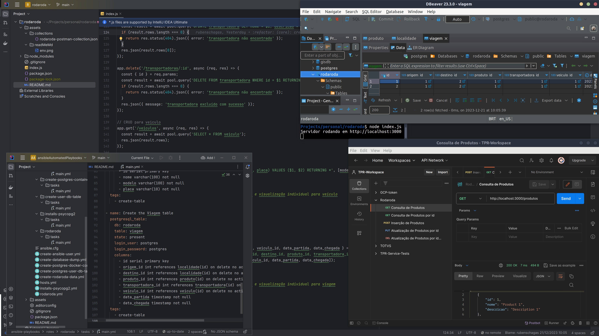

# RODARODA - SIMPLY A CRUD POC

Screenshot:


## TABLE OF CONTENTS

[OVERVIEW](#overview)

[PREREQUISITES](#prerequisites)

[USE CASES](#use-cases)

[SENDING DATA TO THE DATABASE THROUGH THE BACKEND SERVICE](#sending-data-to-the-database-through-the-backend-service)

[REFERENCES](#references)

## OVERVIEW

The objective of this README.md document file is to provide help on how to run the automated deployment of a [local] CRUD project, as a Proof of Concept (POC), running a backend service.

A CRUD Proof of Concept (POC) serves as a foundational demonstration showcasing the essential operations of Create, Read, Update, and Delete within a software application or system. This pivotal phase not only validates the technical feasibility of these core functionalities but also lays the groundwork for the entire application's success.

The Create operation initiates the system's ability to generate new data, fostering an environment for innovation and growth. Reading data ensures seamless access to information, promoting efficiency and informed decision-making. Updates reflect the system's adaptability, allowing for real-time adjustments and improvements. Deletion, while seemingly straightforward, underscores the importance of data management and integrity.

Beyond its technical implications, a CRUD POC symbolizes the inception of a robust and scalable application. It acts as a tangible representation of the development team's prowess, showcasing their ability to translate conceptual ideas into functional realities. This proof of concept is not merely a technical exercise but a strategic step towards building a reliable and user-centric solution.

In the broader context of software development, a well-executed CRUD POC sets the stage for further feature enhancements, integrations, and overall system evolution. Its successful implementation not only assures stakeholders of the project's viability but also instills confidence in the development process.

As developers navigate the intricacies of the CRUD POC, they pave the way for a comprehensive and sophisticated application that aligns with the needs of users and stakeholders alike. In essence, the CRUD POC is not just a technical milestone but a testament to the commitment to excellence in software development.

## PREREQUISITES

```
1. docker: 24.0.7;
2. docker compose: 2.17.2;
3. a postgres dbms server, as found in the https://github.com/rubenschagas/postgres project;
4. run the ansible playbook rodaroda.yml from the https://github.com/rubenschagas/ansibleAutomatedPlaybooks project;
5. a postgres dbms client, like DBeaver: >=23.x (optional);
6. NPM: ^8.11.0;
7. Node: ^16.16.0.
```

On the rodaroda project folder, open a terminal and run the following command:

```
npm install
```

## USE CASES

Start the server:

Make sure the Node.js server is running. 

You can start the server by executing the following command in the terminal within the project directory:

```
node index.js
```

## SENDING DATA TO THE DATABASE THROUGH THE BACKEND SERVICE

It is possible to send requests through Postman to test the CRUD endpoints created in the previous example. 

Here are some steps to test the GET and POST endpoints for the `localidade` entity:

Open the Postman application.

Import the collection file available at assets/collections folder.

Open the `Consulta de Produtos` request.

Send a GET request to list localities:

Select the GET method.
Enter the URL: http://localhost:3000/localidades.
Click "Send" to submit the request.
Send a POST request to create a locality:

Select the POST method.
Enter the URL: http://localhost:3000/localidades.
Go to the "Body" tab and select the raw format.
Insert the locality data in the request body, json, for example:

```
{
"nome": "Localidade Teste",
"tipo": "origem"
}
```

Click "Send" to submit the request.

## REFERENCES

#### [Official Docker Daemon Documentation Install](https://docs.docker.com/engine/install/ubuntu/)

#### [Official Docker Compose Documentation Install](https://docs.docker.com/compose/install/linux/#install-the-plugin-manually)

#### [Official Ansible Documentation Install](https://docs.ansible.com/ansible/2.9/installation_guide/intro_installation.html#installing-ansible-on-ubuntu)
