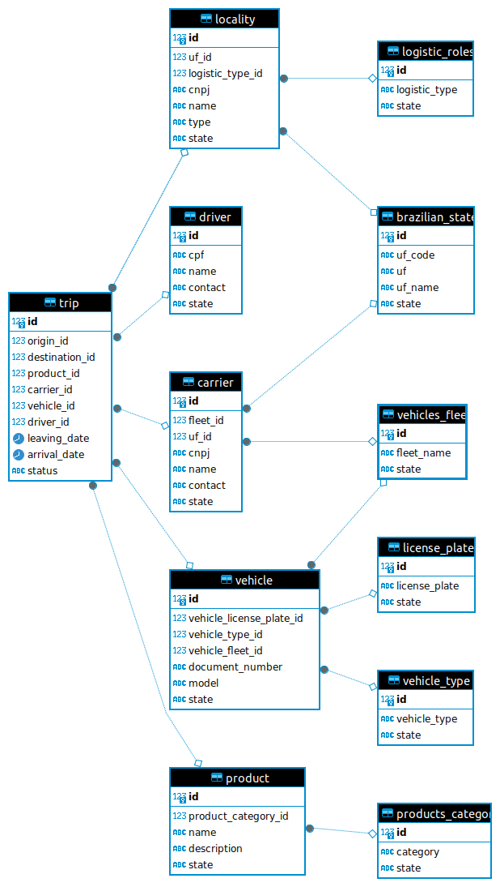
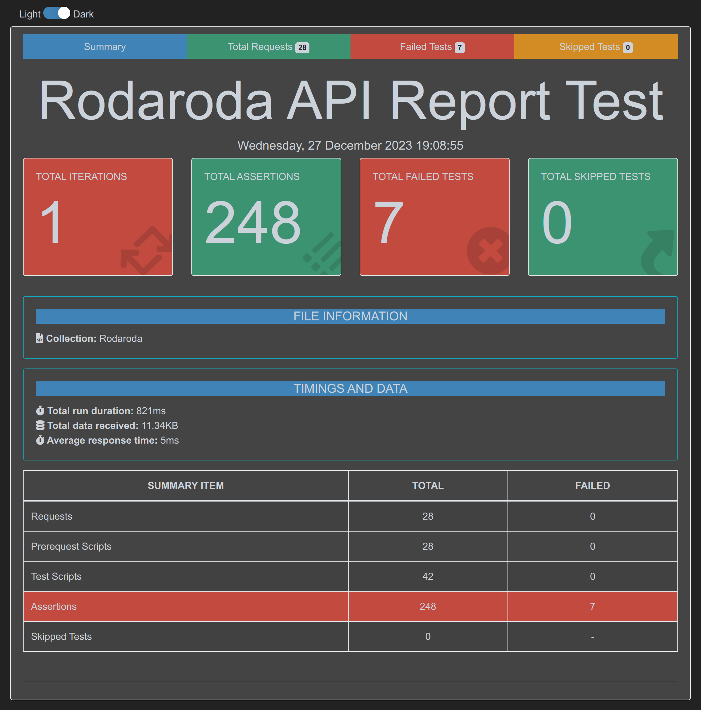
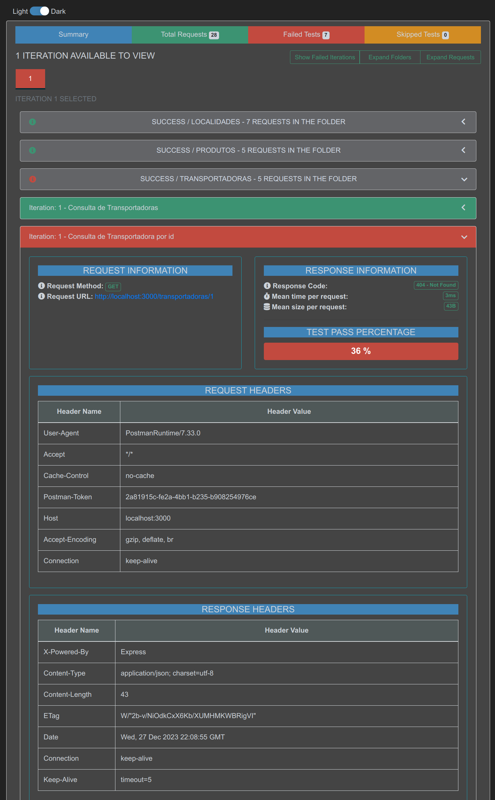
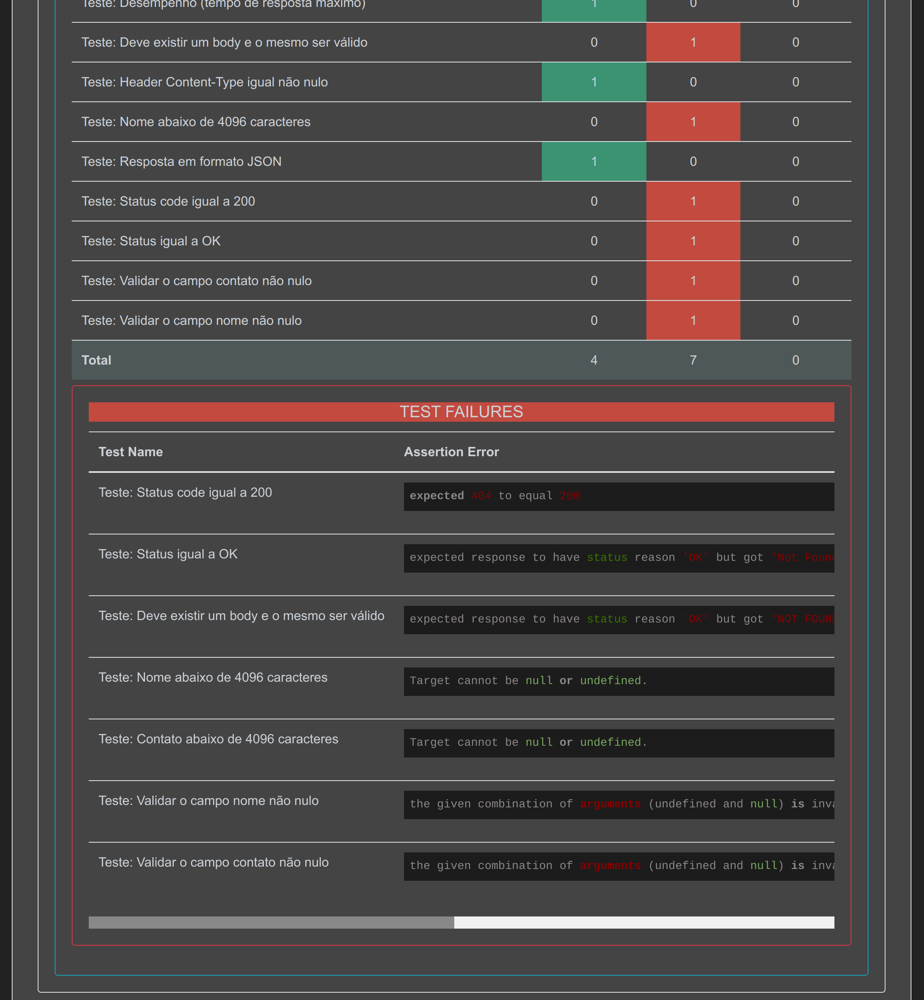

# RODARODA - SIMPLY A CRUD HACKATHON: CRAFTING DEVOPS SOLUTIONS

## TABLE OF CONTENTS

[OVERVIEW](#overview)

[ARCHITECTURE](#architecture)

[PREREQUISITES](#prerequisites)

[USE CASES](#use-cases)

[API](#api)

[TESTING](#testing)

[LICENSE](#license)

[REFERENCES](#references)

[TOOLS](#tools)

## OVERVIEW

This README.md document aims to guide you through the automated deployment of a DevOps project, specifically 
a hackathon featuring a backend service supporting CRUD operations.

The purpose of this app is to build a basic structure for a backend application, along with an automated database,
where, upon sending requests to the backend, we can query and insert data into it.

The master carrier's structure revolves around trips, with dependencies on entities such as location (origin and 
destination types), product, vehicle and carrier.

Furthermore, there is a goal of objectives to achieve, like use standards, design patterns, code formatters, JDoc, 
building an authentication process, frontend, CI-CD, observality, application and business rules enhancements, 
and so on. Thus, the goal is to develop skills in the domains of DevOps, Development, QA, and SRE.

## ARCHITECTURE

### App environment


### App architecture


### Database diagram


### Database structure
Below is the code for the creation of the tables as automated in the Ansible Playbooks:

```
-- Criação da tabela Localidade
CREATE TABLE Localidade (
    localidade_id SERIAL PRIMARY KEY,
    nome VARCHAR(100) NOT NULL,
    tipo VARCHAR(10) CHECK (tipo IN ('origem', 'destino'))
);

-- Criação da tabela Produto
CREATE TABLE Produto (
    produto_id SERIAL PRIMARY KEY,
    nome VARCHAR(100) NOT NULL,
    descricao TEXT
);

-- Criação da tabela Transportadora
CREATE TABLE Transportadora (
    transportadora_id SERIAL PRIMARY KEY,
    nome VARCHAR(100) NOT NULL,
    contato VARCHAR(50)
);

-- Criação da tabela Veículo
CREATE TABLE Veiculo (
    veiculo_id SERIAL PRIMARY KEY,
    modelo VARCHAR(100) NOT NULL,
    placa VARCHAR(20)
);

-- Criação da tabela Viagem
CREATE TABLE Viagem (
    viagem_id SERIAL PRIMARY KEY,
    origem_id INT REFERENCES Localidade(localidade_id) ON DELETE NO ACTION,
    destino_id INT REFERENCES Localidade(localidade_id) ON DELETE NO ACTION,
    produto_id INT REFERENCES Produto(produto_id),
    transportadora_id INT REFERENCES Transportadora(transportadora_id),
    veiculo_id INT REFERENCES Veiculo(veiculo_id),
    data_partida TIMESTAMP,
    data_chegada TIMESTAMP
);
```

## PREREQUISITES

1. docker: 24.0;

2. docker compose: 2.17;

3. a postgres dbms server and populate the database project structure, running the ansible playbook rodaroda.yml,

`ansible-playbook -vv -e "ansible_user=ansible" -K rodaroda.yml`

from the project: https://github.com/rubenschagas/ansibleAutomatedPlaybooks

Note: Ansible playbooks automate the infrastructure setup of the rodaroda application. This includes creating the DBMS running in a Docker container, creating the database, and finally, creating the tables.

4. a postgres dbms client, like DBeaver: >=23.x (optional);

5. npm: ^8.11;

6. node: ^16.16;

7. ts-node: ^10.9.

On the rodaroda project folder, open a terminal and run the following command:

```
npm install
```

Additionally, install the following dependencies:

```
npm install -g newman newman-reporter-htmlextra
```

Newman will execute the Postman collection against the backend, and the newman-reporter-htmlextra will generate a beautiful HTML report for the test run.

## USE CASES

Start the server:

It has a [Command Line Interface](https://github.com/yargs/yargs) e helping a user or a pipeline cloud to inform specific runtime parameters.

You can start the server by executing the following command in the terminal within the project directory:

```
ts-node rodaroda.ts
```

Make sure the Node.js server is running.

This project supports some customized parameters, such as: both tenant and environment of the <i>YMS</i>; user and password credentials; video generation for the scenarios; and so on.

A useful menu help with all possible parameters can be viewed with following command:

```
> ts-node e2e-yms.cli.ts --help
```

Thus, a menu with supported parameters will be showed (some are optional, having a default value):

```
Usage: ts-node rodaroda.ts [-appp 3000] [-dbh localhost] [-dbp 5432] [-dbn
rodaroda] [-dbu postgres] [-dbw postgres]

Options:
      --help     Show help                                             [boolean]
      --version  Show version number                                   [boolean]
  -p, --appp     The application server port number. E.G.: 3000
                                                      [string] [default: "3000"]
  -h, --dbh      The database server hostname. E.G.: localhost|127.0.0.1
                                                 [string] [default: "localhost"]
  -t, --dbp      The database server port number. E.G.: 5432
                                                      [string] [default: "5432"]
  -n, --dbn      The database name. E.G.: rodaroda[string] [default: "rodaroda"]
  -u, --dbu      The database username. E.G.: postgres
                                                  [string] [default: "postgres"]
  -w, --dbw      The database username. E.G.: p******s
                                                  [string] [default: "postgres"]

```

## API

It is possible to send requests through Postman to test the CRUD endpoints created in the previous example. 

The default port is `3000`.

Here are some steps to test the GET and POST endpoints for the `localidade` entity:

Open the Postman application.

Import the collection file available at assets/collections folder.

Open the `Consulta de Localidades` request.

---

Send a GET request to list localities:

Select the GET method.

Enter the URL: http://localhost:3000/localidades

Click "Send" to submit the request.

---

Send a POST request to create a locality:

Select the POST method.

Enter the URL: http://localhost:3000/localidades

Go to the "Body" tab and select the raw format.

Insert the locality data in the request body, json, for example:

```
{
"nome": "Localidade Teste",
"tipo": "origem"
}
```

Click "Send" to submit the request.

---

## TESTING

The tests cover the project endpoints, and users can interpret the results through a report. 

For a description of what the Postman collection covers or what kind of scenarios it tests please open the collection file itself to see them, or see the visual evidence below.

Run the collection tests:

```
newman run assets/collections/rodaroda-postman-collection.json -r htmlextra --reporter-htmlextra-browserTitle "Rodaroda API Report Test" --reporter-htmlextra-title "Rodaroda API Report Test"
```

A folder named `Newman`will be created with a html report file as follows:




## LICENSE

This project is release with a public license.

## REFERENCES

#### [Official Docker Daemon Documentation Install](https://docs.docker.com/engine/install/ubuntu/)

#### [Official Docker Compose Documentation Install](https://docs.docker.com/compose/install/linux/#install-the-plugin-manually)

#### [Official Ansible Documentation Install](https://docs.ansible.com/ansible/2.9/installation_guide/intro_installation.html#installing-ansible-on-ubuntu)

## TOOLS

<p align="left"> 
<a href="https://www.ansible.com" target="_blank" rel="noreferrer"> 
 
</a>
<a href="https://www.docker.com/" target="_blank" rel="noreferrer"> 
 
</a>
<a href="https://git-scm.com/" target="_blank" rel="noreferrer"> 
 
</a> 
<a href="https://www.w3.org/html/" target="_blank" rel="noreferrer"> 
 
</a>
<a href="https://developer.mozilla.org/en-US/docs/Web/JavaScript" target="_blank" rel="noreferrer"> 
 
</a>
<a href="https://www.linux.org/" target="_blank" rel="noreferrer"> 
 
</a>
<a href="https://www.gnu.org/software/bash/" target="_blank" rel="noreferrer"> 
 
</a>
<a href="https://nodejs.org" target="_blank" rel="noreferrer"> 
 
</a>  
<a href="https://www.postgresql.org" target="_blank" rel="noreferrer"> 
 
</a> 
<a href="https://postman.com" target="_blank" rel="noreferrer"> 
 
</a>
<a href="https://www.typescriptlang.org/" target="_blank" rel="noreferrer"> 
 
</a> 
</p>
